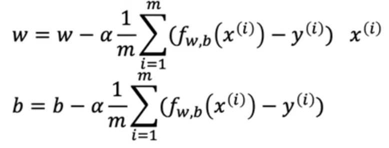

# 机器学习
---
## 1.监督学习
给出输入输出例子，模型学习从x到y的映射关系，完成功能给定一个输入，预测输出值
- 回归算法：用于预测连续值
- 分类算法：用于预测离散类型,有有限种输出

#### 1.1回归模型
**线性回归**：假设输入特征（X）和输出目标（y）之间存在 `线性关系`，即可以用一条直线（或超平面）来拟合数据。
`训练集`：用于训练模型的数据集
`x`:输入变量，（输入）特征
`y`:输出变量，目标变量
`m`:训练示例总数
构建函数：`f(x) = wx + b`代入x得到预估值
`成本函数`：

- 固定一个w或b，另一个参数和 J 图像成**二次函数**趋势

- `m`:训练例子总数  `y^`：通过f(x)得到的预测值  `y`：实际值 `1/2`：方便计算

- `确定函数`：参数w，b对应特定的J，找到`最小的J`所对应的w，b作为最终的函数

- `优化`线性回归：梯度下降（为了找到最小J对应的w,b）

#### 1.2梯度下降

`功能`：最小化函数
参数更新公式：$w_{\text{新}} = w_{\text{旧}} - \alpha \cdot \frac{\partial J}{\partial w}$

$\alpha$:学习率，取0-1之间的正数，控制下坡的步幅
- 过小会使速度很慢，过大会导致过冲，永远达不到最小值，或无法收敛导致发散
- 越接近最小值，导数越小，$\alpha$也应该越小

$\frac{\partial J}{\partial w}$:朝哪个方向迈步（最小值左侧为负，右侧为正）

`代码示例`

$temp w_{\text{}} = w_{\text{}} - \alpha \cdot \frac{\partial J}{\partial w}$
$temp b_{\text{}} = b_{\text{}} - \alpha \cdot \frac{\partial J}{\partial w}$
w = tempw
b = tempb

**`注意w和b同步更新`**

**线性回归的梯度下降表示**

- 对线性回归的平方误差成本函数（函数形状为碗形函数）只有一个最小值

- 对其他函数，不同初始值下的(w,b)，可能会得到不同的局部最小值

#### 1.3分类模型
- 

## 2.无监督学习
从无标签的数据中自动发现隐藏的模式或结构，不需要预先标注的输出结果，而是让算法自行探索数据的内在关系
- 聚类算法：将相似的数据分组
- 降维：压缩数据维度，保留关键特征
- 关联规则学习：发现数据中的频繁模式