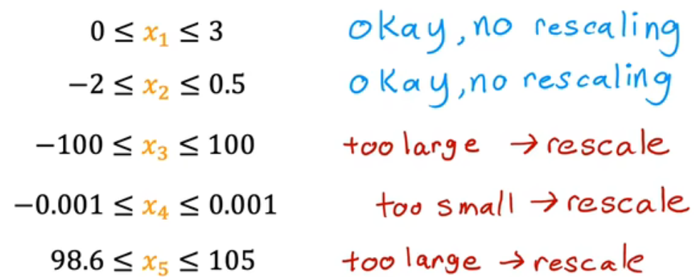

# 机器学习
---
## 1.监督学习
给出输入输出例子，模型学习从x到y的映射关系，完成功能给定一个输入，预测输出值
- 回归算法：用于预测连续值
- 分类算法：用于预测离散类型,有有限种输出

### 1.1回归模型
**线性回归**：假设输入特征（X）和输出目标（y）之间存在 `线性关系`，即可以用一条直线（或超平面）来拟合数据。
`训练集`：用于训练模型的数据集
`x`:输入变量，（输入）特征
`y`:输出变量，目标变量
`m`:训练示例总数
构建函数：`f(x) = wx + b`代入x得到预估值
`成本函数`：

- 固定一个w或b，另一个参数和 J 图像成**二次函数**趋势

- `m`:训练例子总数  `y^`：通过f(x)得到的预测值  `y`：实际值 `1/2`：方便计算

- `确定函数`：参数w，b对应特定的J，找到`最小的J`所对应的w，b作为最终的函数

- `优化`线性回归：梯度下降（为了找到最小J对应的w,b）

#### 1.1梯度下降

`功能`：最小化函数
参数更新公式：$w_{\text{新}} = w_{\text{旧}} - \alpha \cdot \frac{\partial J}{\partial w}$

$\alpha$:学习率，取0-1之间的正数，控制下坡的步幅
- 过小会使速度很慢，过大会导致过冲，永远达不到最小值，或无法收敛导致发散
- 越接近最小值，导数越小，$\alpha$也应该越小

$\frac{\partial J}{\partial w}$:朝哪个方向迈步（最小值左侧为负，右侧为正）

`代码示例`

$temp w_{\text{}} = w_{\text{}} - \alpha \cdot \frac{\partial J}{\partial w}$
$temp b_{\text{}} = b_{\text{}} - \alpha \cdot \frac{\partial J}{\partial w}$
w = tempw
b = tempb

**`注意w和b同步更新`  **

**线性回归的梯度下降表示**


- 对线性回归的平方误差成本函数（函数形状为碗形函数）只有一个最小值

- 对其他函数，不同初始值下的(w,b)，可能会得到不同的局部最小值

#### 1.2 多类特征

**符号说明**
- **\( x_j \)**：第 \( j \) 个特征  
- **\( n \)**：特征的总数 
- **\( \vec{x}^{(i)} \)**：第 \( i \) 个训练样本的所有特征值  
- **\( x_j^{(i)} \)**：第 \( i \) 个样本的第 \( j \) 个特征值 

**多变量的模型:多元线性回归**

$$
f(\mathbf{x}) = w_1x_1 + w_2x_2 + \dots + w_nx_n + b
$$

**线性回归模型（向量形式）**

$$
f_{\vec{w},b}(\vec{x}) = \vec{w} \cdot \vec{x} + b
$$

**符号说明：**
- \( f(\mathbf{x}) \)：模型的预测输出。
- \( w_1, w_2, \dots, w_n \)：权重（对应每个特征的系数）。
- \( x_1, x_2, \dots, x_n \)：输入特征值。
- \( b \)：偏置项（截距）。


#### 1.3 向量化的实现和原理
用向量化的方式实现是最高效的
```bash python
w = np.array([1.0,2.5,-3.3])
b = 4
x = np.array([10,20,30])
f = np.dot(w,x) + b
```
**好处**
1.代码简洁
2.运行速度快（numpy的dot函数可以利用电脑的并行硬件）

#### 1.4 多元线性回归的梯度下降
**梯度下降参数更新公式**

权重 \( w_j \) 的更新：
$$
w_j = w_j - \alpha \frac{\partial}{\partial w_j} J(\vec{w}, b)
$$

偏置 \( b \) 的更新：
$$
b = b - \alpha \frac{\partial}{\partial b} J(\vec{w}, b)
$$

**符号说明**：
- \( w_j \)：第 \( j \) 个特征的权重参数  
- \( b \)：模型的偏置项（截距）  
- \( \alpha \)：学习率（控制更新步长的超参数）  
- \( J(\vec{w}, b) \)：损失函数（依赖于权重向量 \( \vec{w} \) 和偏置 \( b \)）  
- \( \frac{\partial}{\partial w_j} \), \( \frac{\partial}{\partial b} \)：对参数求偏导（梯度方向）  

#### 1.5 正规方程
**注意：** 
- 只能用于线性回归模型
- 当特征数很大时，正规方程会很慢
- 机器学习库中调用线性回归时后台会自动使用这个方法，不用知道原理

#### 1.6 特征缩放
使梯度下降运行更快
一般缩放到范围（-1，1），也可酌情变化

**实现方法**
- **均值归一法（mean normalization）**
  $$
x_i = \frac{x_i - \mu_1}{max - min}
$$
$\mu$ :均值（max+min）/ 2

- **z-score normalization**

标准化公式：$x' = \frac{x - \mu}{\sigma}$
$\mu$:均值
$\sigma$:标准差


### 1.2分类模型
- 

## 2.无监督学习
从无标签的数据中自动发现隐藏的模式或结构，不需要预先标注的输出结果，而是让算法自行探索数据的内在关系
- 聚类算法：将相似的数据分组
- 降维：压缩数据维度，保留关键特征
- 关联规则学习：发现数据中的频繁模式