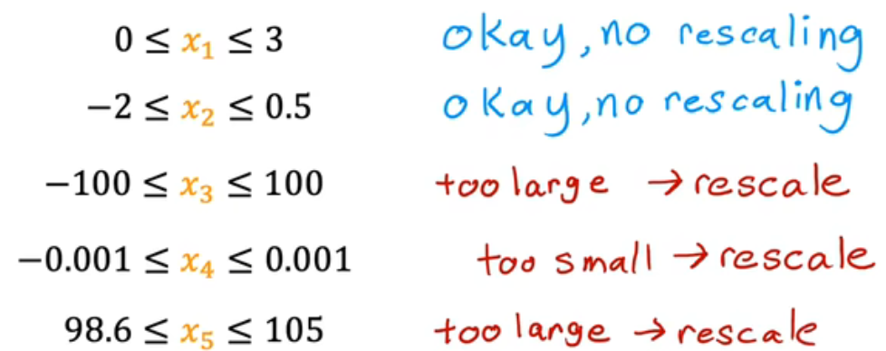

# 高等代数
---

## 1.线性方程组的解


### 1.1矩阵消元法
**阶梯形矩阵**：
- 0行在下方
- 主元（首个非0元）的列指标随着行指标的增大而严格增大
```bash 
eg1.
1  3  1  2   主元：1 1 3
0  1 -1 -3
0  0  3  6
0  0  0  0
```



**矩阵的初等行变换**
- 把一行的倍数加到另外一行
- 两行互换
- 一行乘一个非零数

**简化行阶梯型矩阵**
- 阶梯型矩阵
- 主元都是1
- 主元所在列的其他元素都是1

`矩阵的初等行变换得到的方程组与原来的方程组是同解的`

### 1.2线性方程组的解的情况

**n元线性方程组的解的情况**：无解，唯一解，无穷个解

```bash
eg2.
1 -1  1  1           1 -1  1  1
1 -1 -1  3  --->     0  0  1 -1
2 -2 -1  3           0  0  0 -2
无解
```

把线性方程组的增广矩阵经过初等行变化成阶梯型矩阵，相应的阶梯型方程组如果出现“0 = d（d为非零数）”，则原方程组无解；否则原方程组有解

```bash
eg3.
1 -1  1  1           1 -1  0  2          x1 = x2 + 2
1 -1 -1  3   --->    0  0  1 -1  --->    x3 = -1
2 -2 -1  5           0  0  0  0          方程组的一般解

x1 x3是主变量（以主元为系数的未知量）
x2 是自由未知量（主变量以外的未知量）
```
当有解时，若阶梯矩阵的非零行的数目（r） = 未知数的数目（n），则原方程组有唯一解；若 r < n ，则有无穷个解


