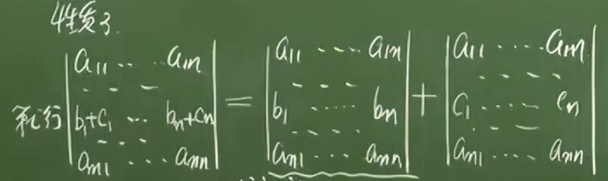

# 高等代数
---

## 1.线性方程组的解
---


### 1.1矩阵消元法
**阶梯形矩阵**：
- 0行在下方
- 主元（首个非0元）的列指标随着行指标的增大而严格增大
```bash 
eg1.
1  3  1  2   主元：1 1 3
0  1 -1 -3
0  0  3  6
0  0  0  0
```


**矩阵的初等行变换**
- 把一行的倍数加到另外一行
- 两行互换
- 一行乘一个非零数

**简化行阶梯型矩阵**
- 阶梯型矩阵
- 主元都是1
- 主元所在列的其他元素都是1

`矩阵的初等行变换得到的方程组与原来的方程组是同解的`

### 1.2线性方程组的解的情况

**n元线性方程组的解的情况**：无解，唯一解，无穷个解

```bash
eg2.
1 -1  1  1           1 -1  1  1
1 -1 -1  3  --->     0  0  1 -1
2 -2 -1  3           0  0  0 -2
无解
```

把线性方程组的增广矩阵经过初等行变化成阶梯型矩阵，相应的阶梯型方程组如果出现“0 = d（d为非零数）”，则原方程组无解；否则原方程组有解

```bash
eg3.
1 -1  1  1           1 -1  0  2          x1 = x2 + 2
1 -1 -1  3   --->    0  0  1 -1  --->    x3 = -1
2 -2 -1  5           0  0  0  0          方程组的一般解

x1 x3是主变量（以主元为系数的未知量）
x2 是自由未知量（主变量以外的未知量）
```
当有解时，若阶梯矩阵的非零行的数目（r） = 未知数的数目（n），则原方程组有唯一解；若 r < n ，则有无穷个解

### 1.3 n元齐次线性方程组
- n元齐次线性方程：常数项 = 0
- (0,0,...,0)是一个n元线性齐次方程组的一个解
- 解的情况：唯一解，无穷个解（有一组非零解则一定有无穷组解）

**推论**
有理数集（或实数集，复数集）内
- 1.系数矩阵（增广矩阵出去常数项）经过初等行变换形成的阶梯型矩阵满足 r < n,可以推得方程组有无穷组解
- 2.n元齐次线性方程组若方程的个数 s < n ，则 r <= s,得 r < n ,有无穷组解

### 1.4 数域
**定义**
- 1.复数集的一个非空子集K，若满足
  - 0，1 $\in$ K；
  - a，b $\in$ K ==> a+-b，ab $\in$ K
  - a, b $\in$ K && b  $\neq$ 0 ==> a/b $\in$ K

则K是一个数域
  
## 2. n阶行列式
---
### 2.1 n元排列

- 2级矩阵 A =                    
$$
\begin{pmatrix}
a & b \\
c & d \\
\end{pmatrix}
$$

- 2阶行列式
$$
\begin{vmatrix}
a & b \\                 
c & d \\
\end{vmatrix}
$$
等于ad-bc
`也称为矩阵A的行列式，记作|A|或detA`
`当|A|！= 0 ，数域K上的系数矩阵A的二元一次方程组有唯一解`
`当|A| = 0 ，···无解或有无穷组解`

n个不同的正整数的一个全排列称为一个**n元排列**
n个不同的正整数形成的n元排列有**n！**个
```bash
全排列：这些数的所有可能排列顺序（共 n! 种）
n元排列：特指这些排列中的某一个具体排列
```
**名词解释**
- **顺序**：从小到大的数对
- **逆序**：从大到小的数对
- **逆序数**：逆序数对的数目，记作 $\tau(2431)$ = 4
- **偶排列**：逆序数是偶数的排列
- **奇排列**：逆序数是奇数的排列
- **对换**：将这个排列中的两个数交换位置，其余数的位置不变，记作（4，1）

**定理**
- 对换`奇数次`会改变排列的奇偶行
- 任意n元排列可以经过一系列的变换互相变


### 2.2 n阶行列式的定义

$$
\begin{vmatrix}
a_{11} & a_{12} & \cdots & a_{1n} \\
a_{21} & a_{22} & \cdots & a_{2n} \\
\vdots & \vdots & \ddots & \vdots \\
a_{n1} & a_{n2} & \cdots & a_{nn} \\
\end{vmatrix}
$$

n阶行列式也称n阶矩阵A = ($a_{ij}$)的行列式，记作|A|，或detA

**上三角形行列式**：主对角线以下都是0
上三角形行列式的值 = 主对角线n个元素的乘积

### 2.3 行列式的性质

- **转置**：将矩阵的行和列互换，得到的新矩阵记作`A'`,则有结论 `|A| = |A'|`
- 若 |A| 的第 i 行 *k 得到 |B| ,则 `|B|= k*|A|`(k = 0 时也成立)
- 将一行的倍数加到另外一行
  
- 若将 |A| 任意两行互换得到 |B| ，则` |B| = - |A|` (两行互换，行列式反号)
- |A|中有两行`相等`，则行列式的值为 `0`
- |A|中有两行`成比例`，则行列式的值为 `0`
- |A|的第 i 行 *l 加到第 k 行得到|D|,则`|A| = |D|` 
**矩阵经过初等行变换得到的新矩阵的值不变**


